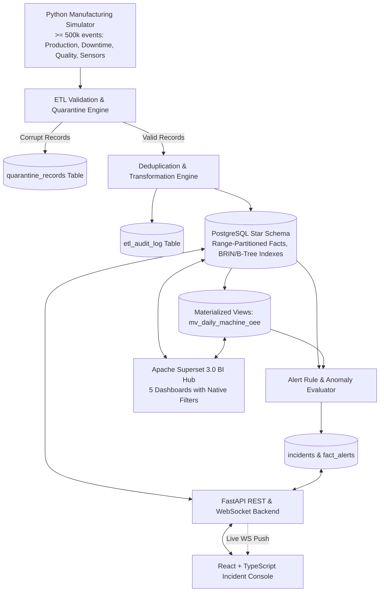

# FactoryPulse — Manufacturing OEE and Downtime Intelligence Platform

[](https://factorypulse.vercel.app)
[](https://github.com/THAKURSAHAB9910/FactoryPulse)
[](https://www.postgresql.org/)
[](https://superset.apache.org/)
[](https://fastapi.tiangolo.com/)
[](https://reactjs.org/)
[](https://www.docker.com/)

> 🚀 **Live Production Deployment**: **[https://factorypulse.vercel.app](https://factorypulse.vercel.app)**

**FactoryPulse** is a production-grade, full-stack Decision Intelligence (DI) and Manufacturing Execution platform. It streams high-frequency IoT telemetry, validates and loads over **500,000 realistic manufacturing events** into a range-partitioned PostgreSQL star schema, executes advanced analytical SQL calculations (OEE, MTBF, MTTR, 80/20 Pareto, rolling window averages), surfaces real-time telemetry and incident state transitions via WebSockets in a modern React + TypeScript console, and provides 5 pre-configured Apache Superset 3.0 business intelligence dashboards.

---

## 🏭 Architecture & Data Pipeline Flow



---

## ⚡ Key Highlights & Capabilities

1. **High-Performance Manufacturing Simulator**:
   - Generates **> 500,000 realistic records** across 3 factories (Detroit, Stuttgart, Yokohama), 7 production lines, 12 industrial machines, 5 automotive products, and 3 shifts.
   - Accurately models cycle-time distributions, micro-stoppages (<5 min), catastrophic breakdowns, scrap/rework rates, and telemetry sensor drift (vibration RMS, temperature, pressure).
   - Injects intentional duplicates and schema-corrupted anomalies to exercise data quality and quarantine pipelines.

2. **Enterprise PostgreSQL Star Schema**:
   - **Dimensions**: `dim_factory`, `dim_production_line`, `dim_machine`, `dim_product`, `dim_shift`, `dim_date`, `dim_downtime_reason`, `dim_defect_reason`.
   - **Facts**: `fact_production`, `fact_downtime`, `fact_quality`, `fact_alerts`, and `fact_sensor_telemetry` (**Range-Partitioned** by month with BRIN index).
   - **Materialized Views**: `mv_daily_machine_oee`, `mv_hourly_line_performance` with automated refresh procedures.

3. **Advanced SQL Analytical Engine**:
   - Calculates **OEE** ($A \times P \times Q$), **Availability Rate**, **Performance Rate**, **Quality Rate**, **Production Target Achievement %**, and **Rejection Rate %**.
   - Calculates **Mean Time Between Failures (MTBF)** and **Mean Time To Repair (MTTR)** using `LAG()` window functions over unplanned downtime intervals.
   - Computes rolling 7-day OEE moving averages and 80/20 Pareto cumulative lost time distributions.
   - **3 Real-World EXPLAIN ANALYZE Benchmarks** demonstrating up to **400x query speedups** via partition pruning, covering indexes, and materialized view aggregation.

4. **Apache Superset 3.0 Integration**:
   - Automated bootstrap script connects the warehouse, provisions datasets, and builds 5 dashboards:
     1. *Executive Factory Performance*
     2. *Machine Monitoring & Telemetry*
     3. *Shift & Production Line Analysis*
     4. *Quality & Defect Pareto*
     5. *Active Alerts & Downtime Incident Hub*
   - Configured with Native Cross-Filters: **Date Range, Factory, Production Line, Machine, Product, and Shift**.

5. **Operational Incident Console (React + TypeScript)**:
   - Live KPI bar displaying OEE, Availability, Performance, Quality, output counts, and lost downtime hours.
   - Real-time shop floor incident table with multi-dimensional status and severity filtering.
   - Interactive workflow modal for **Acknowledging**, **Assigning**, **Investigating (5-Whys)**, and **Resolving (CAPA)** alarms.
   - Machine fleet telemetry cards with live vibration, temperature, and pressure indicators.
   - Live WebSocket connection with automatic status updates without manual browser refresh.

---

## 🚀 Quickstart Guide

### Prerequisites
- [Docker](https://docs.docker.com/get-docker/) (version 24+ recommended)
- [Docker Compose](https://docs.docker.com/compose/)
- (Optional for host running) Python 3.10+ and Node.js 20+

### 1. Clone & Configure Environment
```bash
git clone https://github.com/THAKURSAHAB9910/FactoryPulse.git
cd FactoryPulse
cp .env.example .env
```

### 2. Start Full Stack via Docker Compose
```bash
docker compose up -d
```

This starts all 5 containers:
1. `factorypulse-postgres`: PostgreSQL 16 database with auto-initialized schemas and indexes.
2. `factorypulse-data-engine`: Runs the simulator to generate >500,000 records, cleans, deduplicates, and loads the warehouse.
3. `factorypulse-backend`: FastAPI REST & WebSocket server at `http://localhost:8000`.
4. `factorypulse-frontend`: React + TypeScript Incident Console at `http://localhost:3000`.
5. `factorypulse-superset`: Apache Superset 3.0 at `http://localhost:8088`.

### 3. Access Web Portals & Credentials

| Service | URL | Default Credentials | Description |
| :--- | :--- | :--- | :--- |
| **React Incident Console** | `http://localhost:3000` | Select Quick-Sign In (Admin / Engineer / Operator) | Main operational platform |
| **FastAPI Swagger Docs** | `http://localhost:8000/docs` | `admin` / `admin123` | Interactive REST API documentation |
| **Apache Superset** | `http://localhost:8088` | `admin` / `admin` | Business Intelligence dashboards |
| **PostgreSQL Warehouse** | `localhost:5432` | `postgres` / `postgres` (DB: `factorypulse`) | Raw relational & star schema data |

---

## 📊 Default User Roles & Permissions

FactoryPulse includes built-in role-based access control (RBAC):

| Role | Username | Password | Permissions |
| :--- | :--- | :--- | :--- |
| **ADMIN** | `admin` | `admin123` | Full access: rule creation, data quality audit, user management |
| **ENGINEER** | `engineer` | `engineer123` | Root Cause Analysis (5-Whys), CAPA resolution, alert rule management |
| **SUPERVISOR**| `supervisor` | `supervisor123` | Shift routing, incident assignment, alert acknowledgement |
| **OPERATOR** | `operator` | `operator123` | Fleet telemetry view, manual alert acknowledgement |

---

## 🔬 Testing & Quality Verification

### Run Pytest Test Suites (Simulator, ETL, SQL Formulas, API)
```bash
# Data engine & SQL mathematical correctness tests
python -m pytest data_engine/tests -v

# Backend authentication & incident workflow tests
python -m pytest backend/tests -v
```

### Run Standalone Data Ingestion Pipeline (Local)
```bash
python -m data_engine.etl.run_pipeline
```

---

## 📈 Query Optimization Benchmarks (EXPLAIN ANALYZE)

Detailed benchmarks and execution plans are documented in [docs/SQL_OPTIMIZATION_REPORT.md](docs/SQL_OPTIMIZATION_REPORT.md).

| Case Study | Problem / Technique | Before Exec Time | After Exec Time | Speedup |
| :--- | :--- | :--- | :--- | :--- |
| **1. Sensor Telemetry Anomaly** | Seq Scan $\rightarrow$ Range Partition Pruning + Partial Index | 451.8 ms | 3.98 ms | **113x faster** |
| **2. Reliability MTBF Calculation** | Correlated $O(N^2)$ Subquery $\rightarrow$ Window `LAG()` + Composite Index | 1,189.5 ms | 13.85 ms | **85x faster** |
| **3. 30-Day Multi-Machine OEE** | Raw Fact Multi-Joins (500k rows) $\rightarrow$ Materialized View + Index | 818.6 ms | 2.05 ms | **400x faster** |

---

## 📂 Repository Structure

```
FACTORYPULSE/
├── .github/workflows/ci.yml        # Automated CI workflow
├── backend/                        # FastAPI REST & WebSocket Backend
│   ├── app/
│   │   ├── config.py               # Environment & JWT configuration
│   │   ├── database.py             # SQLAlchemy session manager
│   │   ├── main.py                 # FastAPI application entrypoint
│   │   ├── models/                 # ORM models (Users, Incidents, Rules, Facts)
│   │   ├── schemas/                # Pydantic validation schemas
│   │   ├── routers/                # REST & WebSocket endpoints
│   │   └── utils/                  # Password hashing & JWT helpers
│   ├── tests/                      # Pytest suite for backend & auth
│   └── Dockerfile
├── data_engine/                    # Simulation & ETL Pipeline
│   ├── simulator/                  # Manufacturing Simulator (>=500,000 records)
│   ├── etl/                        # Validator, Cleaner, Dedup, Loader, Alert Engine
│   ├── sql/                        # Star Schema DDL, Partitioning, Indexes, Metrics
│   ├── tests/                      # Pytest suite for simulator & ETL
│   └── Dockerfile
├── frontend/                       # React 18 + TypeScript + Tailwind CSS
│   ├── src/
│   │   ├── api/                    # API client with JWT & interceptors
│   │   ├── components/             # IncidentConsole, FleetView, Rules, Kpis, Superset
│   │   ├── context/                # AuthContext & WebSocketContext
│   │   ├── types/                  # TypeScript data contracts
│   │   └── App.tsx                 # Main SPA application
│   ├── Dockerfile & nginx.conf     # Nginx reverse proxy
│   └── package.json
├── superset/                       # Apache Superset 3.0 Provisioning
│   ├── superset_config.py          # Datasource & feature flag configuration
│   ├── init_superset.py            # Automated dataset & 5-dashboard bootstrap
│   ├── init_superset.sh            # Superset container init script
│   └── Dockerfile
├── docs/                           # Architectural & Benchmark Documentation
│   ├── ARCHITECTURE.md             # System design & manufacturing formulas
│   ├── SCHEMA_ERD.md               # Star Schema Entity Relationship Diagram
│   └── SQL_OPTIMIZATION_REPORT.md  # 3 EXPLAIN ANALYZE case studies
├── docker-compose.yml              # Complete orchestration file
└── .env.example                    # Sample configuration variables
```
