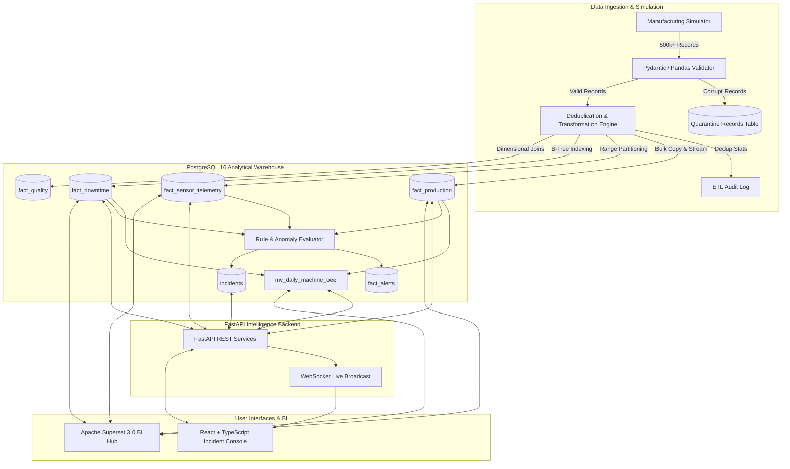

# FactoryPulse — System Architecture & Data Flow



## Manufacturing Mathematics

### 1. Overall Equipment Effectiveness (OEE)
$$\text{OEE} = \text{Availability} \times \text{Performance} \times \text{Quality}$$

- **Availability Rate**:
  $$\text{Availability} = \frac{\text{Operating Minutes}}{\text{Planned Production Minutes}} = \frac{\text{Planned Minutes} - \text{Total Downtime Minutes}}{\text{Planned Minutes}}$$

- **Performance Rate**:
  $$\text{Performance} = \min\left(1.0, \frac{\text{Total Units Produced} \times \text{Ideal Cycle Time (sec)}}{\text{Operating Minutes} \times 60}\right)$$

- **Quality Rate**:
  $$\text{Quality} = \frac{\text{Good Units}}{\text{Total Units Produced}} = \frac{\text{Total Units} - \text{Scrap Units} - \text{Rework Units}}{\text{Total Units}}$$

### 2. Reliability Engineering (MTBF & MTTR)
- **MTTR (Mean Time To Repair)**:
  $$\text{MTTR} = \frac{\sum \text{Unplanned Downtime Duration (Hours)}}{\text{Number of Equipment Breakdowns}}$$

- **MTBF (Mean Time Between Failures)**:
  $$\text{MTBF} = \frac{\text{Total Operating Uptime (Hours)}}{\text{Number of Equipment Breakdowns}}$$
  *Calculated in SQL using window lag:*
  ```sql
  LAG(dt.end_time) OVER (PARTITION BY dt.machine_id ORDER BY dt.start_time ASC)
  ```

- **Inherent Availability ($A_i$)**:
  $$A_i = \frac{\text{MTBF}}{\text{MTBF} + \text{MTTR}} \times 100\%$$
