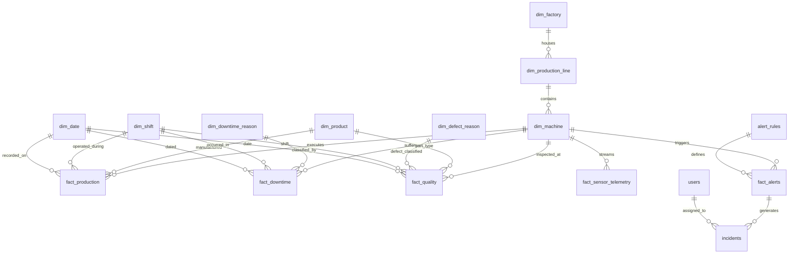

# FactoryPulse — Database Schema & Star Schema ERD

## Dimensional Model Details

### 1. Dimension Tables
| Dimension | Primary Key | Description | Granularity |
| :--- | :--- | :--- | :--- |
| `dim_factory` | `factory_id` | Plant site, city, country, timezone, square meters | Plant location |
| `dim_production_line` | `line_id` | Stamping, Welding, Machining, Assembly, Paint lines | Production line |
| `dim_machine` | `machine_id` | Machine specs, ideal cycle time sec, rated power kW, bottleneck tag | Individual machine |
| `dim_product` | `product_id` | Part code, unit cost, scrap cost, target cycle time | Part / SKU |
| `dim_shift` | `shift_id` | Morning (6-14), Afternoon (14-22), Night (22-6), break & planned mins | 8-hour shift |
| `dim_date` | `date_key` | Date integer `YYYYMMDD`, day of week, week, month, quarter, year | Calendar day |
| `dim_downtime_reason` | `reason_id` | Planned PM vs Unplanned Breakdown (Mechanical, Electrical, Material) | Stoppage reason |
| `dim_defect_reason` | `defect_id` | Dimensional, surface, porosity, welding spatter defect classification | Defect root code |

### 2. Fact Tables
| Fact Table | Grain | Partitioning / Strategy | Key Metrics |
| :--- | :--- | :--- | :--- |
| `fact_production` | Single production cycle per part serial number | Composite B-Tree Indexes | `ideal_cycle_time_sec`, `actual_cycle_time_sec`, `is_good_part`, `is_scrap`, `energy_kwh` |
| `fact_downtime` | Individual downtime / stoppage event | Windowed & B-Tree indexed on `(machine_id, start_time)` | `duration_minutes`, `is_micro_stoppage`, MTBF intervals, MTTR repair time |
| `fact_quality` | Inspection batch per machine & product | Indexed on `(date_key, machine_id, product_id)` | `inspected_count`, `defect_count`, `scrap_count`, `defect_rate_pct`, `scrap_cost_usd` |
| `fact_sensor_telemetry` | High-frequency telemetry stream | **Range-Partitioned by `recorded_at`** (monthly) + BRIN Index | `vibration_rms`, `temperature_c`, `pressure_bar`, `power_kw`, `motor_rpm`, `is_anomaly` |
| `fact_alerts` | Automated threshold breach event | Foreign key to `alert_rules` and `dim_machine` | `observed_value`, `threshold_value`, `severity`, `triggered_at` |

### 3. Operational & Governance Tables
| Table | Purpose |
| :--- | :--- |
| `incidents` | Tracks full resolution lifecycle: Open $\rightarrow$ Acknowledged $\rightarrow$ Investigating $\rightarrow$ Resolved. Stores 5-Whys root cause and CAPA notes. |
| `alert_rules` | Configurable rules evaluating OEE, downtime, vibration, temperature, and scrap rate thresholds. |
| `etl_audit_log` | Records every pipeline run with rows extracted, rows loaded, rows deduplicated, rows rejected, and runtime. |
| `quarantine_records` | Isolates corrupt/invalid JSON payloads with exact validation rejection reason. |
| `users` | Role-based operational accounts (`ADMIN`, `ENGINEER`, `SUPERVISOR`, `OPERATOR`) with bcrypt password hashing. |
| `mv_daily_machine_oee` | Materialized view aggregating daily machine availability, performance, quality, and OEE. |
